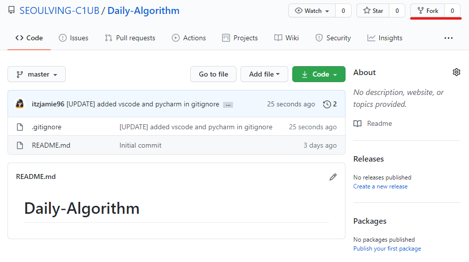
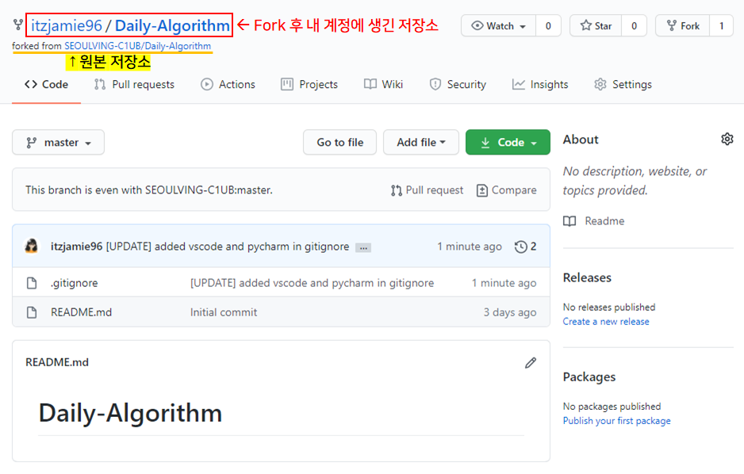

# :rocket: Git 사용법 정리 :rocket:

>SEOUL Solving Club 에서 코드 공유를 위한 git 사용법 정리입니다. 궁금한 점, 에러메세지 등은 제이미에게 빠른 연락주세용

## 참고한 사이트 
[GitHub Help](https://help.github.com/en/github)   
[Pro Git Book](https://git-scm.com/book/en/v2)
[git 초보를 위한 풀리퀘스트(pull request) 방법](https://wayhome25.github.io/git/2017/07/08/git-first-pull-request-story/)

<br>


## 1. Git config 설정

Git을 설치하고 나서 가장 먼저 해야 하는 것은 username과 email을 설정하는 것입니다 (물론 다들 되어있겠지만) . Git은 commit할 때마다 이 정보를 사용합니다. 

<br>

**Cmd / Bash에서 내 정보 등록하기**

  ```
git config --global user.name "내 이름"
git config --global user.email example@example.com
  ```

**git config 설정 확인 하기**

```
git config --list
```

- 저장된 username 등을 확인할 수 있습니다.

<br>

## 2. Git Fork
Fork는 다른 사람의 Repository(저장소)를 내 GitHub으로 복사하는 것입니다 (:fork_and_knife:포크로 남의 저장소를 찍어오는 것!). 흔히 fork는 다름 사람의 프로젝트를 수정하고 싶을 때(원본은 그대로 남겨두고) 사용합니다. 

Fork한 저장소를 원본(기존의 저장소)와 연결해 놓으면 내 저장소에서 수정한 사항을 원본 저장소에서 반영할 수 있게 됩니다. 

<br>

**워크샵 저장소 Fork 하기**



- [워크샵 저장소](https://github.com/SEOULVING-C1UB/Daily-Algorithm)로 들어가 `Fork`를 선택한다

<br>



- 내 github에 새로운 저장소가 생긴 것을 확인할 수 있다

<br>

## 3. Git Clone
`git clone`은 원격 저장소를 내 로컬 저장소로 복사해서 가져오는 것이다. Fork한 내 저장소를 로컬 환경에 복사해오도록 하자. 

<br>

#### Fork한 내 저장소 Clone하기

1. Clone with HTTPS (원격 저장소 주소 복사)


  - :star:**내 저장소**:star:에서 로컬 환경으로 `clone`해주는 거 잊지 말기! **원본 저장소가 아니라** 내꺼!!!

    

2. 원하는 위치의 디렉토리에서 cmd 열기   
```
예시) C:\Git
```

3. `git clone` + 복사한 저장소 주소    
```
$ git clone https://github.com/내 계정/Daily-Algorithm.git
```

4. Enter   
```
$ git clone https://github.com/내 계정/Daily-Algorithm.git
Cloning into 'Daily-Algorithm'...
remote: Enumerating objects: 7, done.
remote: Counting objects: 100% (7/7), done.
remote: Compressing objects: 100% (6/6), done.
remote: Total 7 (delta 1), reused 3 (delta 0), pack-reused 0
Unpacking objects: 100% (7/7), 2.98 KiB | 98.00 KiB/s, done.
```

- `clone` 완료!

<br>

## 4. Remote 설정

`remote`로 특정 저장소를 설정해주는 것은 현재 `clone`한 내 저장소를 다른 저장소(우리의 경우 서울빙 클럽 내 워크샵 저장소)랑 **연결**시키겠다는 의미라고 보시면 됩니다. 

<br>

1. :star:**[원본 저장소](https://github.com/SEOULVING-C1UB/Daily-Algorithm)**:star:에서 `clone`을 위한 링크를 받아옵니다.


2. **Clone한 내 저장소**(=로컬에 있는 내꺼)가 있는 위치에서 `bash` 혹은 `terminal`을 열고 

3. `git remote add` + SolvingClub + 복사해온 **원본 저장소의 주소** + Enter   

```bash
$ git remote add SolvingClub https://github.com/SEOULVING-C1UB/Daily-Algorithm.git
```

> 여기서 SolvingClub은 연결시킬 원본 저장소를 부를 이름입니다. SeoulvingC1ub은 항상 타자치기 귀찮을 것 같아서 SolvingClub이라고 했습니다. 헷갈리지 않게 그냥 맞추는 걸로! 

4. 잘 됐는지 확인하기

```bash
$ git remote -v
SolvingClub     https://github.com/SEOULVING-C1UB/Daily-Algorithm.git (fetch)
SolvingClub     https://github.com/SEOULVING-C1UB/Daily-Algorithm.git (push)
origin  https://github.com/내 계정/Daily-Algorithm.git (fetch)
origin  https://github.com/내 계정/Daily-Algorithm.git (push)
```

> 보시다시피 SolvingClub이 원본 주소랑 연결돼있고 origin은 내 계정에 있는 같은 이름의 저장소입니다

<br>


## 6. 코드 추가 후 add, commit, push

> 로컬에 있는 내 저장소에 코드, md파일, 폴더 등 추가하고 평소처럼 add commit push하시면 됩니다

#### git 명령어 빠르게 복습

- **add**
  - 전체 변경 내용 add: `git add .`       
  - 특정 폴더 add: `git add 폴더이름/`
  
- **commit**   
  - `git commit -m "커밋 메시지"`   

- **push**   
  - `git push origin master`

#### Commit Message 규칙

1. 첫 추가: [ADD] 본인 이름 + 문제 이름/번호
2. 수정: [UPDATE] 본인 이름 + 문제 이름/번호 + 수정 사항
3. 삭제: [DELETE] 본인 이름 + 문제 이름/번호

**ex)**

`git commit -m "[ADD] 김아무개 전기버스"`

`git commit -m "[UPDATE] 김아무개 전기버스 주석 수정했음"`

`git commit -m "[DELETE] 김아무개 전기버스"`

