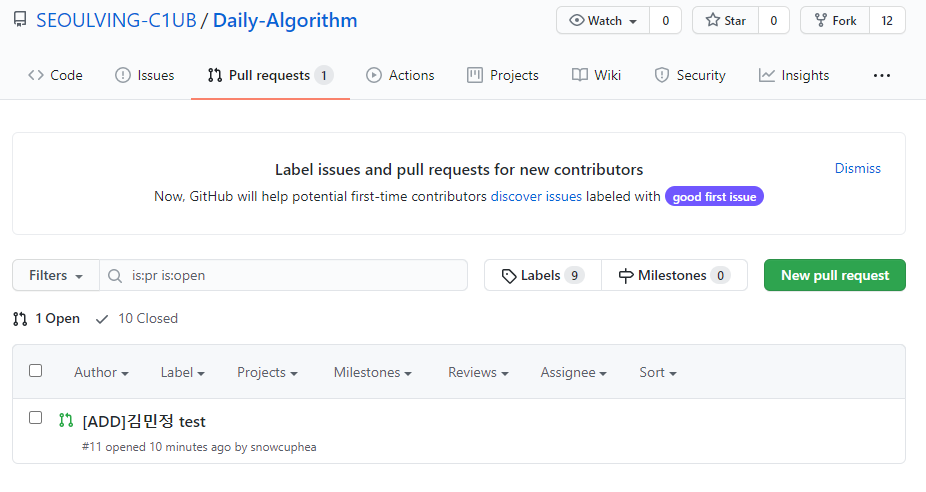
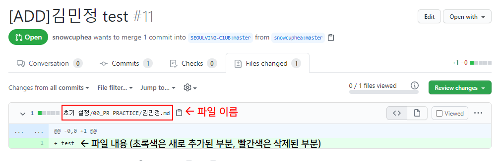
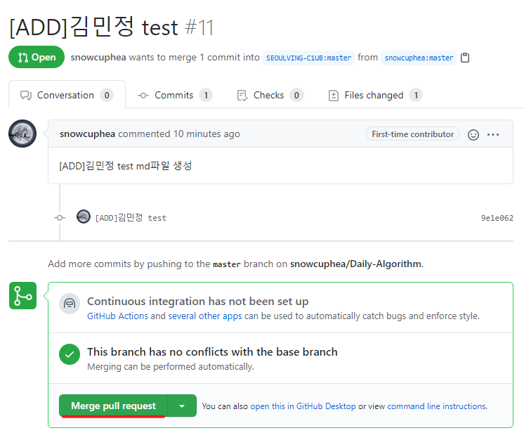

# 관리자를 위한 merge 전 확인 목록

호오오오옥시라도 남의 코드까지 수정해서 commit되는 일을 방지하기 위해 merge전 확인하는 작업입니다.

1.  pull request를 확인한다

   

2. Merge를 대뜸 누르기 전 어떤 파일인지 확인한다

   

3. 파일 내용을 호다닥 살펴본다

   

4. 별 문제가 없으면 merge를 한다

   

